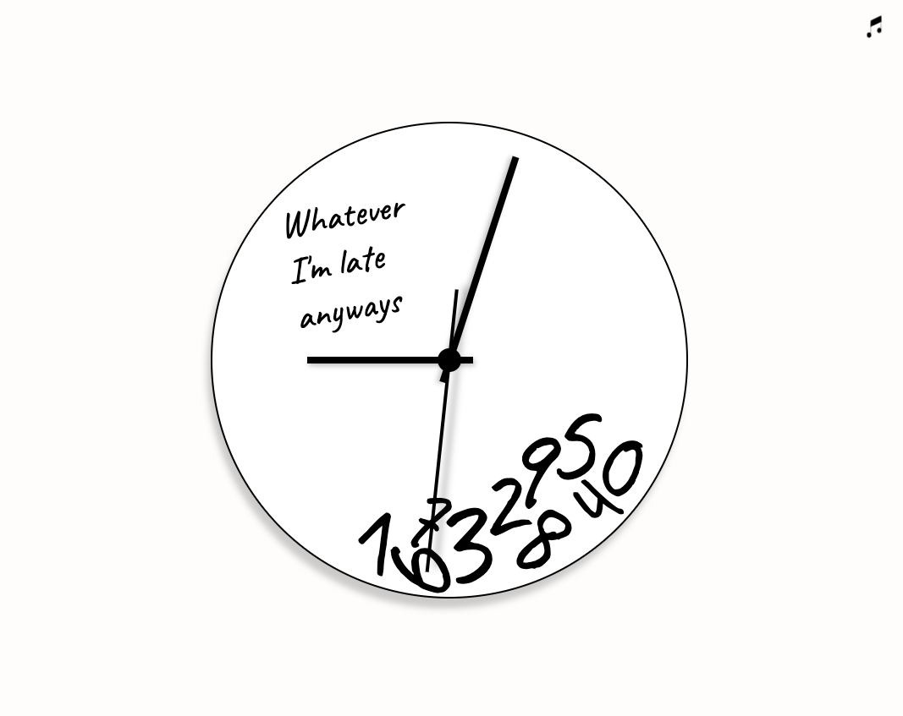

# Tick Tock Tech Clock

## About
Tick Tock Tech Clock is a web-based clock application that displays the time using the traditional clock face with hour, minute, and second hands. The clock hands move in real-time to reflect the current time, and users have the option to turn on/off the ticking sound effect. This project was built using plain CSS and JavaScript.

PS: After being inspired by Wes Bos' JAVASCRIPT30 course, I decided to follow it and build the Tick Tock Tech Clock application to keep my hands dirty with JavaScript.

## Table of contents

- [ Features ](#features)
- [ Demo ](#demo)
- [ Installation ](#installation)
- [ Usage ](#usage)
- [ Contributing ](#contributing)
- [ License ](#license)

## Features

- Displays the time using a traditional clock face with hour, minute, and second hands.
- Clock hands move in real-time to reflect the current time.
- Ticking sound effects can be turned on/off.

## Demo
Here are the links to the live demo and the video demo of the Tick Tock Tech Clock:

- [Live Demo Link](https://maha-magdy.github.io/tick-tock-tech-clock/)
- 

## Installation

To install the Tick Tock Tech Clock on your local machine, follow these steps:

Clone this repository: `git clone https://github.com/Maha-Magdy/tick-tock-tech-clock.git`
Open the `index.html` file in your web browser

## Usage

To use the Tick Tock Tech Clock, simply open the index.html file in your web browser. The clock will automatically start displaying the current time, and the ticking sound effect can be turned on/off by clicking the sound icon.

## Contributing

Contributions, issues, and feature requests are welcome!

Feel free to check the [issues page](https://github.com/Maha-Magdy/tick-tock-tech-clock/issues).

## Acknowledgments

- Sound Effects from <a href="https://mixkit.co/">mixkit</a>
- Music note icon from <a href="https://lordicon.com/">lordicon</a>
- <a href="https://javascript30.com/">JAVASCRIPT30 course</a> for Wes Bos

## License

This project is [MIT](./LICENSE) licensed.

## Show your support

Give a ⭐️ if you like this project!
